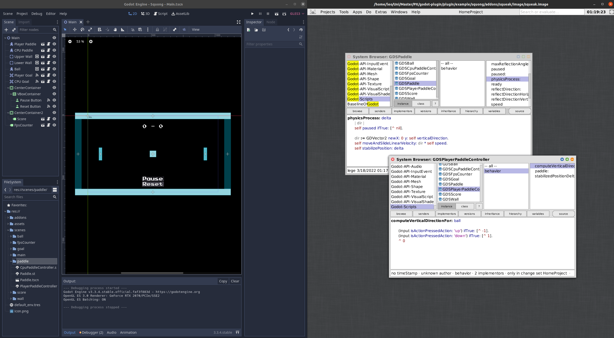
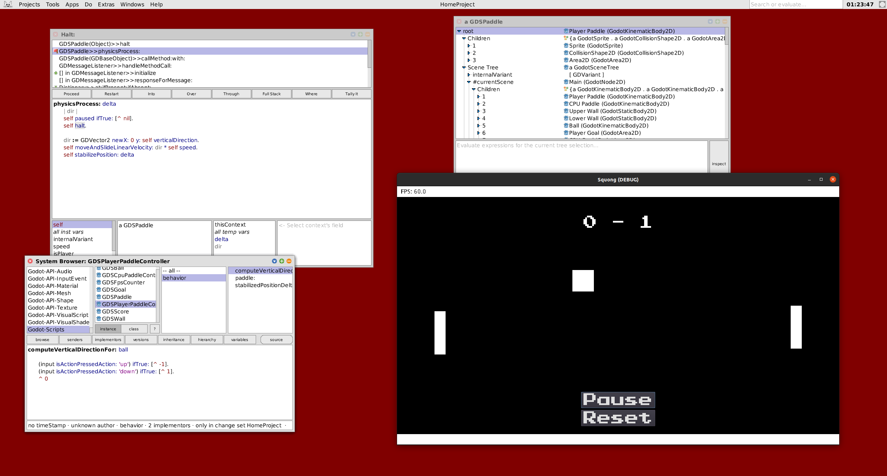
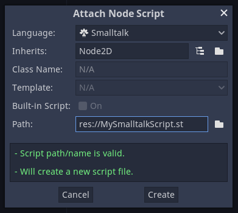

# Godot-Squeak

Godot-Squeak is a Squeak/Smalltalk language binding for the Godot game engine.

Using this language binding, we now have access to the Squeak environment and ecosystem during development with Godot.
This includes the Squeak debugger and advanced projects like [Sandblocks](https://github.com/hpi-swa/sandblocks).
Workflows within Godot and Squeak remain largely unchanged and interact well with each other.
Furthermore, the code used to define Godot logic is very similar to its GDScript-equivalent while being idiomatic Smalltalk.
We thus expect that this language binding is easy and intuitive to use for Godot and Smalltalk developers alike.

Developed for the Programming Experience seminar WS21/22.

Note: This project was developed for Godot 3.3 and may not work with other versions.

Currently only supports Linux.




## Building the Plugin

```bash
cd plugin
make
```

## Creating the Image

### With the script

This will create a Godot-ready image in the `plugin/addons/squeak/image` directory.

```bash
plugin/scripts/createImage.sh plugin/addons/squeak/image
```

### Manually

If you want to create a Godot-ready image manually, e.g. if you want to use a different image than the default, first install the Godot-API package:

```Smalltalk
Metacello new
	baseline: 'Godot';
	repository: 'github://hpi-swa-lab/godot-squeak:main/squeak';
	load.
```

Then, start the message listener:

```Smalltalk
GDMessageListener restart
```

## Installing into a Godot Project

Place a symlink to the `plugin/addons` directory into the Godot project directory.

```bash
ln -s "$PWD/addons" path/to/godot-project
```

A Squeak image named `squeak.image` must be placed in `plugin/addons/squeak/image`.
See [creating the image](#creating-the-image).

## Usage

For the plugin to work, a message listener process must be running in Squeak.
If the process is not running, you may start it with
```Smalltalk
GDMessageListener restart
```

If the message listener is not running, Godot may freeze.
Only one message listener process should be active.

### Creating scripts

You can attach Smalltalk scripts to Nodes just like you would with GDScript.
Make sure to select Smalltalk as the language in the script creation window.
Creating a script will create a corresponding class in the `Godot-Scripts` category within Squeak.



Just like in Godot, the script inherits from the respective Godot object.
This means that it has access to all of its parent's methods and properties via `self`.

Within that class you will find pre-generated methods like `#ready` and `#process`.
They have the same role as their Godot equivalents.
You may delete them if they are unnecessary.

### Calling methods

#### Calling Godot methods from Squeak

Methods that are part of the Godot API, such as `Node.add_to_group(...)` have pre-generated Squeak equivalents.
You can find them in their respective Squeak class (e.g. `GodotNode>>addToGroup:`)

You may need to call a method that does not exist in Squeak, such as a method defined in a custom GDScript.
In that case, an ad-hoc Squeak method with the same name up to the first colon will call it.
For instance, a GDScript method defined as follows

```python
func my_method(argumentOne, argumentTwo):
  print(argumentOne + argumentTwo)
```

may be called with this Squeak code:

```Smalltalk
aGodotObject my_method: 'one' and: 'two'
```

If the Godot method has varargs, they may be passed as an array to the `withArguments:` parameter.

#### Calling Squeak methods from GDScript

A Squeak method may be called from GDScript by replacing the colons of its selector with underscores.
For instance, a Squeak method defined as follows

```Smalltalk
GDSCustomScript>>add: aNumber and: anotherNumber
  ^ aNumber + anotherNumber
```

may be called with this GDScript code:

```python
aSqueakObject.add_and_(1, 2)
```

Note the trailing underscore which is necessary if the method takes at least one argument.

### Exporting properties

Custom properties may be exported by writing a getter/setter pair.
The getter must contain an `export:` pragma.
This pragma takes a string which returns the default value of the property when evaluated with `value`.
For simple values, simply passing them as a string should suffice, but you may also put them into a block within the string.

Example:

```Smalltalk
GDSCustomScript>>customProperty
  <export: '[true]'>
  ^ customProperty

GDSCustomScript>>customProperty: value
  customProperty := value
```

### Custom signals

The names of any signals that the script can emit should be returned in the class-side `#signal` method within an array.

```Smalltalk
GDSCustomScript class>>signals
  ^ #('signalOne' 'signalTwo')
```

Signals can be emitted with the `#emitSignal:` method

### Globals

Godot's globals also exist as globals in Squeak.
Their names are in snake-case.

```Smalltalk
(input isActionJustPressedAction: 'left') ifTrue: [self goLeft].
```
